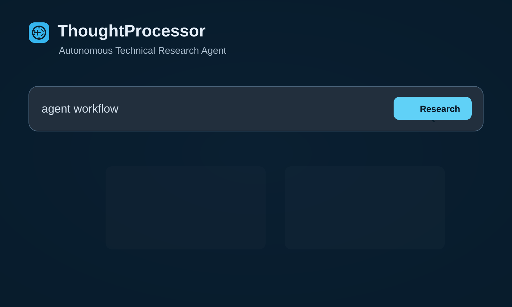
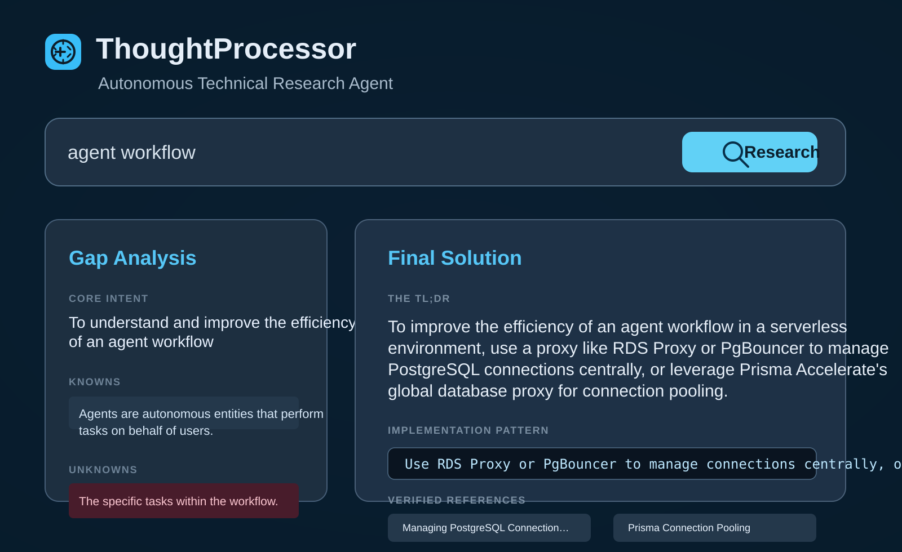
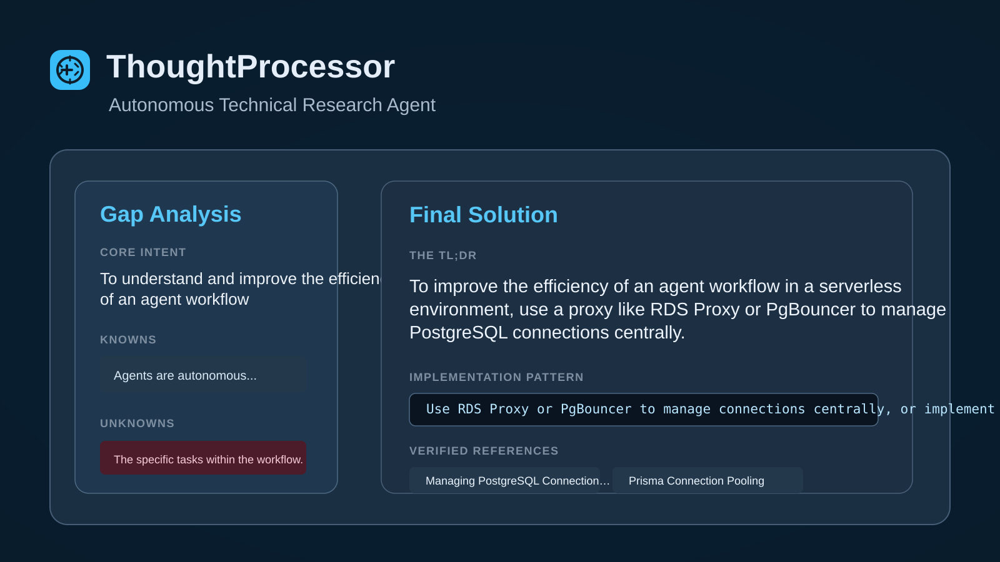

# 🧠 ThoughtProcessor

ThoughtProcessor is an autonomous technical research agent that transforms raw, fragmented queries into structured, production-ready technical solutions. Instead of just providing an LLM's best guess, it analyzes what it *doesn't* know, researches official documentation and community discussions, and synthesizes a verified solution.

## 🚀 How it Works

The application follows a four-stage autonomous pipeline:

1.  **Ingestion & Gap Analysis**: Decomposes your prompt to identify the core intent and pinpoint exactly what information is missing (Knowns vs. Unknowns).
2.  **Autonomous Research**: Generates optimized search queries and uses AI-native search APIs to scrape high-signal data from GitHub, DevDocs, and technical blogs.
3.  **Synthesis**: Processes the raw research into a structured format consisting of a TL;DR, tested code patterns, and live references.
4.  **Interactive Memory**: Stores the resolved "thought" in a local vector database, turning your research history into a searchable personal knowledge base.

## 🛠️ Tech Stack

- **Runtime**: Node.js & TypeScript
- **Local AI**: Ollama (Llama3 / Phi3)
- **Search**: Tavily AI
- **Storage**: SQLite-vec / Local Vector Store
- **Frontend**: React, Tailwind CSS, Framer Motion

## 🌟 Why this repo gets attention

ThoughtProcessor is built for people who want more than a chatbot answer: it explains the missing context, researches the right sources, and turns the result into a clear, actionable technical recommendation.

If you are shipping agent workflows, research-heavy product ideas, or technical decision tooling, this repo shows a very strong pattern for turning ambiguous prompts into trustworthy output.

## 📸 Screenshots

### Research workflow

### Final solution dashboard

### Result cards and verified references

## 🏁 Getting Started

### Prerequisites
- [Ollama](https://ollama.com/) installed and running.
- Llama3 or Phi3 model pulled (`ollama pull llama3`).

### Installation
\`\`\`bash
npm install
cd frontend
npm install
\`\`\`

### Configuration
Create a `.env` file in the root directory:
\`\`\`env
ANTHROPIC_API_KEY=your_key_here (Optional)
TAVILY_API_KEY=your_key_here
\`\`\`

### Usage
1. Start the backend:
\`\`\`bash
npx tsx src/server.ts
\`\`\`
2. Start the frontend:
\`\`\`bash
cd frontend
npm run dev
\`\`\`
3. Open the browser to the local URL provided (usually http://localhost:5173).
